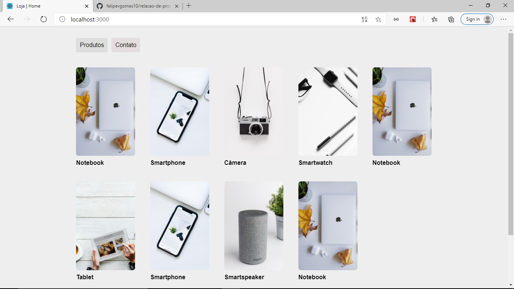
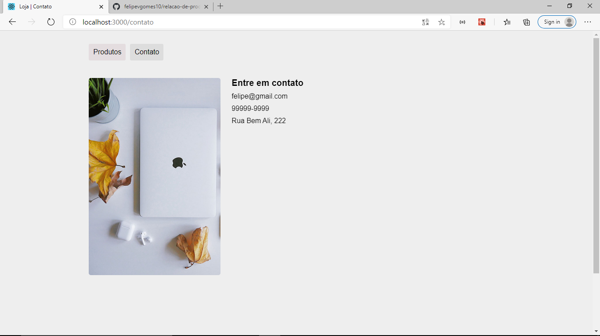
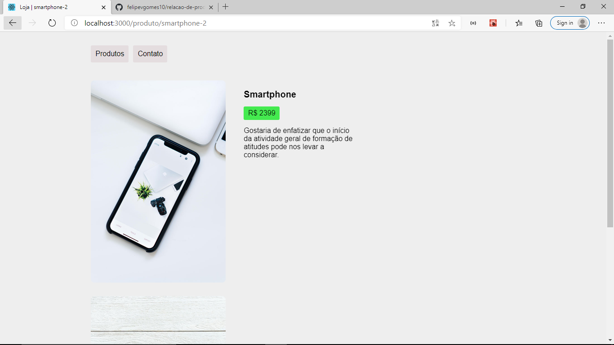

# Relação de produtos feita com React.JS

Esse é uma projeto que visa simular uma loja virtual na qual é possivel ver uma relação dos produtos disponiveis.

# Rotas

O projeto foi criado com o create-react-app e ainda conta com o as dependências _**history**_ e _**react-router-dom**_ para possibilitar a criação de diferentes rotas na aplicação.

# Rota /


# Rota /contato


# Rota /produto/:id

Com a utilização do _**":id"**_ (a palavra id pode ser substituída por outra, desde que o : seja mantido), temos a possibilidade de criar rotas e páginas dinâmicas que mudam de acordo com a palavra que quisermos. Com o uso do hook _**useParams**_ do react-router-dom podemos ter acesso à palavra passada em ":id", e dessa utilizar de várias estratégias para deixar nossa página dinâmica, como por exemplo, filtar uma array de objetos com base nessa palavra.



# React hooks

O projeto faz uso de hooks como _**useState, useEffect e useContext**_ de forma inteligente para a máxima otimização do mesmo.

# Iniciando o projeto

Como  esse porjeto foi criado com o create-react-app, ele faz uso de inúmeras dependências e para baixá-las basta rodar o comando abaixo com o terminal aberto na pasta do projeto:
```
npm install
```
